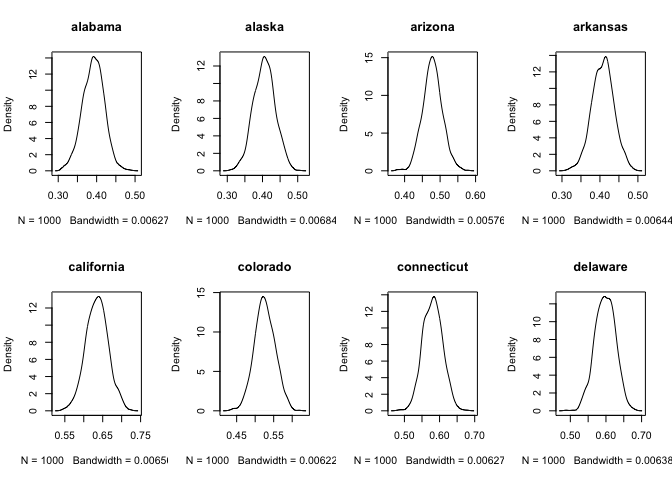
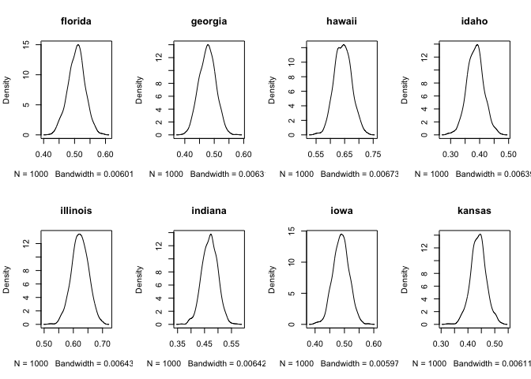
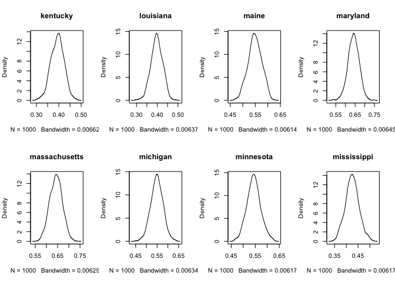
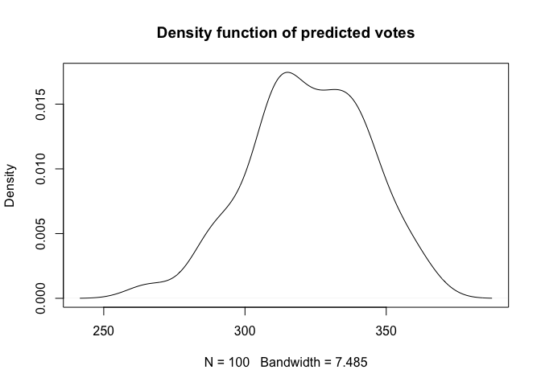

Summary
=======

We utilized data from 2008 and 2012 Election to predict the distribution of result for Election 2016 using simulation. A lot of the predictions of this election would only give an expectation of the final result. Some may also provide a probability of the certainty of their prediction. In this project, we tried to replicate the shape of probability density function of the result. We first fitted the data with logistic model with mixed effect at both state level and individual level. Then we used R package {arm} simulated 100 alphas’ and betas’ based of the fitted model to obtain 100 simulated models. Then we fitted the historical data into the simulated models, which gives us 100 simulated results for each state. And finally, we used the 100 simulated results to call for each state, which helps us to achieve the final result --- the distribution of votes. Even though the election result is not our model expect, by the end of the day, we believe it is the learning curve of this process that actaully matters.

Data
====

The data we used contained background information of each poll, ,identified by their pollers’ id, along with information about voting percentage for Democratic and Republican Party, start and end date, sample size, number of dates till the election day(recorded as negative number), the historical final results (from year 1992 to 2012) for each state, etc.
For each state, there were several time points of polling. We treated each poll differently regard to their time points when fitting the overall model, and then view each poll independently (ignore time effect) when using simulation.

### further explaination for each variable that is used.

There is a sneek peak of the data that we used.

    ##     state Clinton Trump Other Undecided poll_id              pollster
    ## 1 alabama      36    57    NA         7   25356 WashPost/SurveyMonkey
    ## 2 alabama      40    53    NA         7   25537         Ipsos/Reuters
    ## 3 alabama      36    58    NA        NA   25727            UPI/CVOTER
    ## 4 alabama      37    57    NA         6   26097         Ipsos/Reuters
    ## 5 alabama      38    56    NA        NA   26022            UPI/CVOTER
    ## 6 alabama      38    52    NA        10   26407         Ipsos/Reuters
    ##   start_date end_date sample_subpopulation sample_size     mode
    ## 1      20675    20698    Registered Voters         958 Internet
    ## 2      20692    20712        Likely Voters         628 Internet
    ## 3      20709    20722        Likely Voters         558 Internet
    ## 4      20713    20733        Likely Voters         580 Internet
    ## 5      20729    20736        Likely Voters         332 Internet
    ## 6      20727    20747        Likely Voters         773 Internet
    ##   partisanship partisan_affiliation date id DemPctAll DemPctHead2Head
    ## 1  Nonpartisan                 None  -68 25 0.3600000       0.3870968
    ## 2  Nonpartisan                 None  -54 25 0.4000000       0.4301075
    ## 3  Nonpartisan                 None  -44 25 0.3829787       0.3829787
    ## 4  Nonpartisan                 None  -33 25 0.3700000       0.3936170
    ## 5  Nonpartisan                 None  -30 25 0.4042553       0.4042553
    ## 6  Nonpartisan                 None  -19 25 0.3800000       0.4222222
    ##       wtsByVar wtsByState stateAbbrev pctRep92 pctRep96 pctRep00 pctRep04
    ## 1 0.0002476543        0.2          AL 53.82356  53.7307 57.58719  62.9003
    ## 2 0.0003903106        0.4          AL 53.82356  53.7307 57.58719  62.9003
    ## 3 0.0004234875        0.6          AL 53.82356  53.7307 57.58719  62.9003
    ## 4 0.0004115218        0.8          AL 53.82356  53.7307 57.58719  62.9003
    ## 5 0.0007254005        1.0          AL 53.82356  53.7307 57.58719  62.9003
    ## 6 0.0003155894        1.2          AL 53.82356  53.7307 57.58719  62.9003
    ##   pctRep08 pctRep12   evWts color
    ## 1 13.14419 11.52369 15.8972  blue
    ## 2 13.14419 11.52369 15.8972  blue
    ## 3 13.14419 11.52369 15.8972  blue
    ## 4 13.14419 11.52369 15.8972  blue
    ## 5 13.14419 11.52369 15.8972  blue
    ## 6 13.14419 11.52369 15.8972  blue

Linear model
============

We first tried simple OLS model for our prediction. We did a very simple OLS that inclues the election result from each state for the past two elections with fixed effect for each State. Also, we inlude the date of each poll that we believe might be affecting the actual result.

``` {.r}
lm <- lm(DemPctHead2Head~date+pctRep08+pctRep12+factor(id),data = election)
```

GLM model
=========

\(headothead = \beta_1*p08 + \beta_2*p12 +\alpha_{1i} * time +\alpha_{0i}+ \beta_0+\epsilon\)

\(\alpha_{1i} \sim N(\beta_{3i},\sigma_{\alpha_1})\)

\(\alpha_{0i} \sim N(0,\sigma_{\alpha_0})\)

For the mix effect model, we try to keep the model very simple as well. We only inlclude the polling date, election result form 12 and 08. Also, we imposed both fixed effect and ramdom effect on the intercept and the slope of date for each state. So that we would allow some flexibility for each individual state.

We used the lme4 package from R.

    ## Warning: package 'lme4' was built under R version 3.2.5

    ## Loading required package: Matrix

    ## Linear mixed model fit by REML ['lmerMod']
    ## Formula: 
    ## DemPctHead2Head ~ I(date/365) + pctRep08 + pctRep12 + (I(date/365) |  
    ##     id)
    ##    Data: election
    ##  Subset: date > -250
    ## 
    ## REML criterion at convergence: -3942.2
    ## 
    ## Scaled residuals: 
    ##     Min      1Q  Median      3Q     Max 
    ## -4.0654 -0.6307 -0.0215  0.5632  3.5214 
    ## 
    ## Random effects:
    ##  Groups   Name        Variance  Std.Dev. Corr 
    ##  id       (Intercept) 0.0008007 0.02830       
    ##           I(date/365) 0.0014540 0.03813  -0.01
    ##  Residual             0.0007260 0.02695       
    ## Number of obs: 945, groups:  id, 50
    ## 
    ## Fixed effects:
    ##               Estimate Std. Error t value
    ## (Intercept)  0.5091407  0.0043049  118.27
    ## I(date/365) -0.0126199  0.0090939   -1.39
    ## pctRep08    -0.0006595  0.0020353   -0.32
    ## pctRep12    -0.0077717  0.0018749   -4.15
    ## 
    ## Correlation of Fixed Effects:
    ##             (Intr) I(/365 pctR08
    ## I(date/365)  0.174              
    ## pctRep08     0.055  0.001       
    ## pctRep12    -0.078 -0.001 -0.976

<table style="text-align:center"><caption>
<strong>GLM Regression Results</strong>
</caption>
<tr><td colspan="3" style="border-bottom: 1px solid black"></td></tr><tr><td style="text-align:left"></td><td colspan="2">
<em>Dependent variable:</em>
</td></tr>
<tr><td></td><td colspan="2" style="border-bottom: 1px solid black"></td></tr>
<tr><td style="text-align:left"></td><td colspan="2">
DemPctHead2Head
</td></tr>
<tr><td style="text-align:left"></td><td>
<em>linear</em>
</td><td>
<em>OLS</em>
</td></tr>
<tr><td style="text-align:left"></td><td>
<em>mixed-effects</em>
</td><td>
<em></em>
</td></tr>
<tr><td style="text-align:left"></td><td>
(1)
</td><td>
(2)
</td></tr>
<tr><td colspan="3" style="border-bottom: 1px solid black"></td></tr><tr><td style="text-align:left">
I(date/365)
</td><td>
-0.013
</td><td></td></tr>
<tr><td style="text-align:left"></td><td>
(0.009)
</td><td></td></tr>
<tr><td style="text-align:left"></td><td></td><td></td></tr>
<tr><td style="text-align:left">
date
</td><td></td><td>
-0.00003<sup>\*\*</sup>
</td></tr>
<tr><td style="text-align:left"></td><td></td><td>
(0.00002)
</td></tr>
<tr><td style="text-align:left"></td><td></td><td></td></tr>
<tr><td style="text-align:left">
pctRep08
</td><td>
-0.001
</td><td>
-0.002
</td></tr>
<tr><td style="text-align:left"></td><td>
(0.002)
</td><td>
(0.007)
</td></tr>
<tr><td style="text-align:left"></td><td></td><td></td></tr>
<tr><td style="text-align:left">
pctRep12
</td><td>
-0.008<sup>\*\*\*</sup>
</td><td>
-0.009
</td></tr>
<tr><td style="text-align:left"></td><td>
(0.002)
</td><td>
(0.006)
</td></tr>
<tr><td style="text-align:left"></td><td></td><td></td></tr>
<tr><td style="text-align:left">
Constant
</td><td>
0.509<sup>\*\*\*</sup>
</td><td>
0.514<sup>\*\*\*</sup>
</td></tr>
<tr><td style="text-align:left"></td><td>
(0.004)
</td><td>
(0.006)
</td></tr>
<tr><td style="text-align:left"></td><td></td><td></td></tr>
<tr><td colspan="3" style="border-bottom: 1px solid black"></td></tr><tr><td style="text-align:left">
Observations
</td><td>
945
</td><td>
945
</td></tr>
<tr><td style="text-align:left">
R<sup>2</sup>
</td><td></td><td>
0.867
</td></tr>
<tr><td style="text-align:left">
Adjusted R<sup>2</sup>
</td><td></td><td>
0.859
</td></tr>
<tr><td style="text-align:left">
Log Likelihood
</td><td>
1,971.102
</td><td></td></tr>
<tr><td style="text-align:left">
Akaike Inf. Crit.
</td><td>
-3,926.203
</td><td></td></tr>
<tr><td style="text-align:left">
Bayesian Inf. Crit.
</td><td>
-3,887.394
</td><td></td></tr>
<tr><td style="text-align:left">
Residual Std. Error
</td><td></td><td>
0.028 (df = 894)
</td></tr>
<tr><td style="text-align:left">
F Statistic
</td><td></td><td>
116.464<sup>\*\*\*</sup> (df = 50; 894)
</td></tr>
<tr><td colspan="3" style="border-bottom: 1px solid black"></td></tr><tr><td style="text-align:left">
<em>Note:</em>
</td><td colspan="2" style="text-align:right">
<sup>*</sup>p\<0.1; <sup>**</sup>p\<0.05; <sup>***</sup>p\<0.01
</td></tr>
</table>

The Simulation
==============

We used the sim function form arm package to simulate the beta's from the mixed effect result. This function gives the simulation of betas based on the covariance matrix of the variables.

We simulated 1000 sets of betas in total.

Here is a sample of the simulation result that are generated

Fixed effect

``` {.r}
head(fixedcoef)
```

    ##      (Intercept)  I(date/365)      pctRep08     pctRep12
    ## [1,]   0.5176505 -0.004233702 -0.0038706142 -0.005276723
    ## [2,]   0.5107366 -0.018059851  0.0034208902 -0.011605390
    ## [3,]   0.5100672 -0.010340245 -0.0007266133 -0.007251664
    ## [4,]   0.5072850 -0.010401858  0.0002620159 -0.008916394
    ## [5,]   0.5058427 -0.013890195  0.0031477771 -0.011384992
    ## [6,]   0.5097622 -0.001448891 -0.0036255488 -0.005433442

random effect

``` {.r}
head(randcoef)
```

    ## [1] -0.04193675 -0.02130522 -0.03602497 -0.02803753 -0.01741091 -0.01803724

error term

``` {.r}
head(sigma.hat(simulation))
```

    ## [1] 0.02622993 0.02675139 0.02754131 0.02746524 0.02789914 0.02698077

Here we have the distribution result for each State.

  

Then, we call for each state, and summed for total electoral result.


